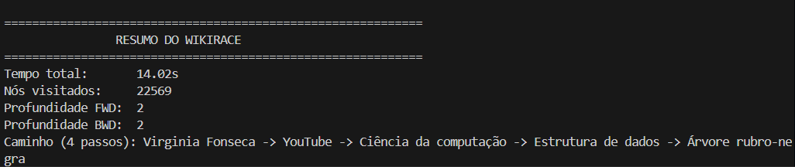
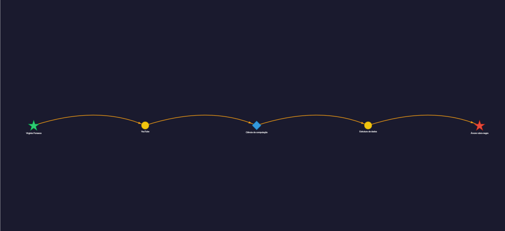
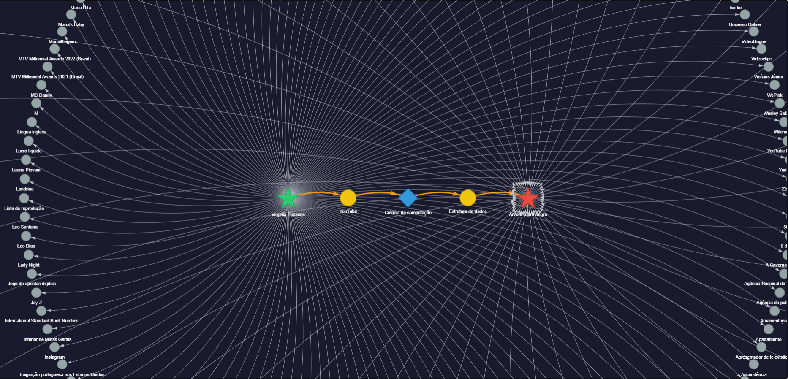

# G20 Grafos EDA2 (Wikirace)

Projeto academico da disciplina de Estruturas de Dados 2. Trata-se de um explorador de grafos que encontra o caminho mais curto de cliques entre dois artigos da Wikipedia.

## Demonstração Visual

**Apresentação e Demonstração do Projeto (Vídeo):** [Link do YouTube]()

### 1. Terminal (Estatísticas e Execução)


### 2. Grafo do Caminho (Rota mais curta)


### 3. Grafo de Exploração (Nós visitados)


## Alunos
| Matrícula | Aluno |
| -- | -- |
| 241025990  | Pedro Henrique Ferreira Xavier |
| 241025247  | Gustavo Xavier Evangelista |

## Sobre o Projeto

O algoritmo simula o famoso jogo "Wikirace", partindo de um artigo de origem e buscando alcancar um artigo de destino clicando apenas nos links internos. O projeto utiliza a MediaWiki API para buscar as relacoes entre os artigos em tempo real.

Devido ao alto fator de ramificacao da Wikipedia (onde um unico artigo pode conter centenas de links), o projeto resolve o problema de explosao combinatoria utilizando o algoritmo de Busca Bidirecional em Largura (Bidirectional BFS).

## Arquitetura

O projeto esta modularizado em responsabilidades estritas:

* config.py: Centraliza variaveis de ambiente, URLs da API, limites de concorrencia e politicas de timeout e retry.
* models.py: Contem as estruturas de dados (dataclasses) utilizadas, como os Nos do grafo.
* wiki_client.py: Modulo puramente de rede. Lida com chamadas HTTP assincronas para a Wikipedia, limites de paginacao e tratamento de falhas.
* wikirace_engine.py: O motor logico. Implementa o BFS Bidirecional, semaforos de concorrencia, deteccao de intersecao e camadas de cache para outlinks e backlinks.
* visualizer.py: Exportador do grafo. Recebe a arvore percorrida e o caminho vencedor para renderizar um documento HTML interativo usando Pyvis.

## Dependencias

* Python 3.10+
* aiohttp (Requisicoes assincronas e controle de conexao)
* networkx (Estruturacao do grafo)
* pyvis (Visualizacao web do grafo)
* pytest (Suite de testes unitarios)

## Como Executar (Passo a Passo)

### 1. Clonar o Repositório e Acessar a Pasta
```bash
git clone https://github.com/EDA2/G20_Grafos_EDA2-2026.1.git
cd G20_Grafos_EDA2-2026.1
```

### 2. Criar e Ativar o Ambiente Virtual (Recomendado)
* **Windows (PowerShell):**
  ```powershell
  python -m venv venv
  .\venv\Scripts\Activate.ps1
  ```
* **Linux / macOS:**
  ```bash
  python3 -m venv venv
  source venv/bin/activate
  ```

### 3. Instalar as Dependências
```bash
pip install -r requirements.txt
```

### 4. Executar o Wikirace
Passe o artigo de **origem** e o artigo de **destino** entre aspas como argumentos:

```bash
python main.py "Banana" "Física quântica"
```

> **Dicas Adicionais:**
> - Adicione a flag `-v` (verbose) para acompanhar o progresso das requisições em tempo real no nível DEBUG.
> - Adicione a flag `-d <num>` ou `--max-depth <num>` para aumentar a profundidade de exibição na árvore de exploração (o padrão é 1 para economizar memória, mas pode ser aumentado para exibir mais nós gerados durante a busca).
>
> ```bash
> python main.py -v -d 2 "Banana" "Física quântica"
> ```

### 5. Visualizar os Grafos Interativos
Ao finalizar a busca, o terminal exibirá um quadro estatístico completo e gerará dois arquivos HTML interativos na raiz do projeto:
- **`grafo_caminho.html`**: Visualização limpa contendo apenas a rota mais curta encontrada.
-  **`grafo_exploracao.html`**: Árvore completa com todos os nós explorados durante a busca bidirecional.

*(Dê um duplo clique nos arquivos `.html` gerados ou utilize `Ctrl + Clique` nos links impressos ao final da execução no terminal).*

### 6. Executar a Suíte de Testes
Para rodar os 29 testes unitários e de integração:

```bash
pytest tests/ -v
```

